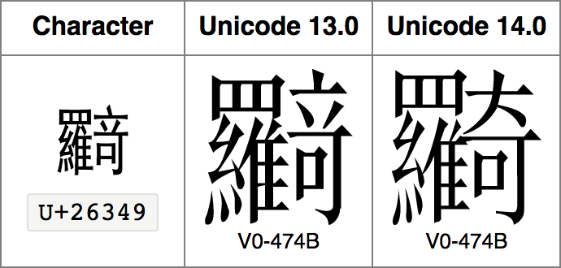

# CJK Glyphs Diff

List of CJK glyphs differences between Unicode 13.0 and 14.0.

- Running the sample script `Create CJK Glyphs Diff HTML Files` from the `JavaScript Runner` utility of the latest version of the [Unicopedia Sinica](https://github.com/tonton-pixel/unicopedia-sinica) application generates the following HTML files on the `Desktop` folder:

    - `CJK-G-source-glyphs-13.0-14.0-diff.html`
    - `CJK-K-source-glyphs-13.0-14.0-diff.html`
    - `CJK-M-source-glyphs-13.0-14.0-diff.html`
    - `CJK-T-source-glyphs-13.0-14.0-diff.html`
    - `CJK-UK-source-glyphs-13.0-14.0-diff.html`
    - `CJK-UTC-source-glyphs-13.0-14.0-diff.html`
    - `CJK-V-source-glyphs-13.0-14.0-diff.html`

- Pre-generated HTML files are available for download from the [latest release](https://github.com/tonton-pixel/cjk-glyphs-diff/releases/latest).

- For each CJK source are listed the following differences, if any:

    - Removed glyphs
    - Added glyphs
    - Changed glyphs

